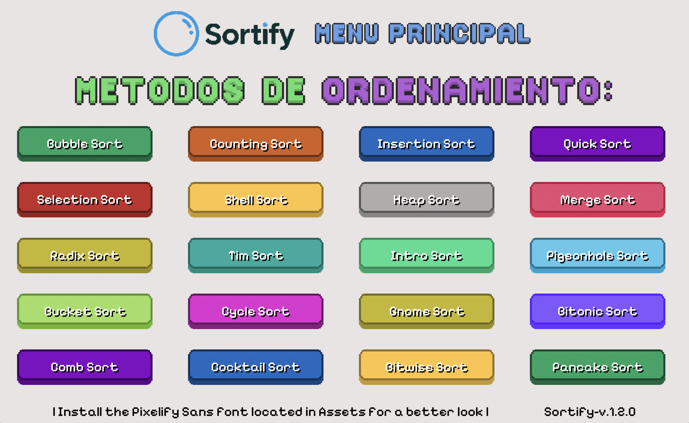
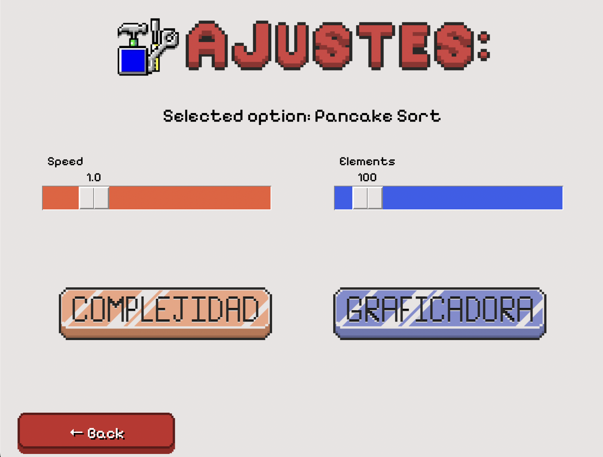
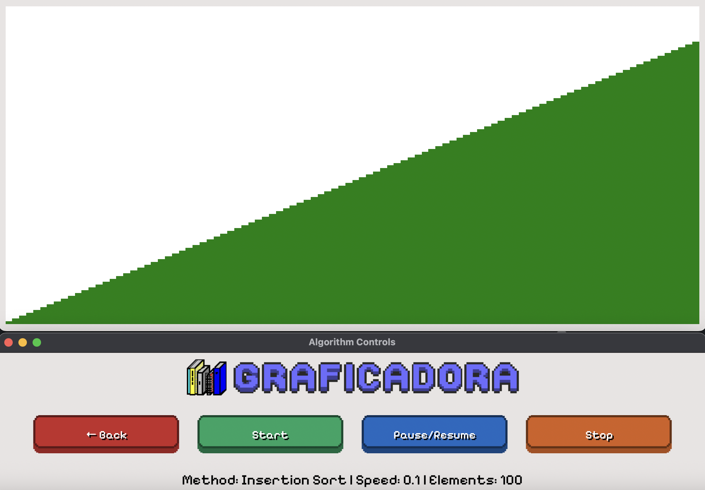
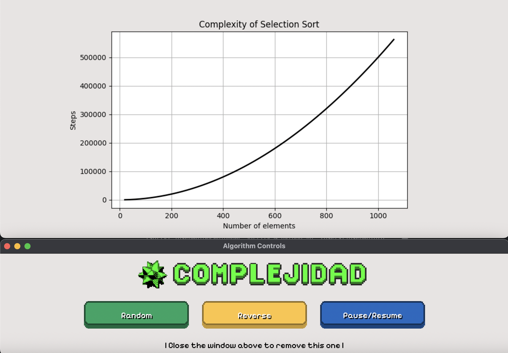

<div align="center">


# 🎨 Sortify

### A Python desktop application to visualize and compare sorting algorithms

<p align="center">

 
 
 


</p>

*Learn how sorting algorithms actually work through real-time visualization.*

</div>

---

# 📖 About

Sortify is a Python desktop app built with **Tkinter** that lets you *see* how sorting algorithms work. If you've ever wondered what actually happens inside Bubble Sort or Quick Sort, this is for you!

It animates the sorting process bar by bar, and it can also plot how an algorithm's number of steps grows as the list gets bigger, so you get both the visual intuition and the complexity behind it.

---

# 🏠 Main Menu

This is the first screen you see. Pick any of the 20 sorting algorithms below and Sortify will take you to its settings screen.

<p align="center">

</p>

---

# ⚙️ Settings

Here you choose how the algorithm runs before watching it:

- ⚡ **Speed** — how fast the animation plays.
- 📊 **Elements** — how many bars (numbers) will be sorted.

From here you can also choose what to open next:

- 🎞️ Sorting Visualizer
- 📈 Complexity Grapher

<p align="center">

</p>

---

# 🎞️ Sorting Visualizer

This window shows the algorithm sorting a list of random bars in real time.

You can:

- ▶️ Start
- ⏸️ Pause / Resume
- ⏹️ Stop

The current algorithm, animation speed and number of elements are always shown at the bottom.

<p align="center">

</p>

---

# 📈 Complexity Grapher

Instead of animating bars, this window measures how the algorithm behaves as the input size increases.

You can:

- 📊 Compare complexity growth
- 🔀 Use random lists
- 🔄 Use reverse-ordered lists
- ⏸️ Pause the analysis at any time

<p align="center">

</p>

---

# 🧩 Sorting Algorithms Included

Sortify currently ships with **20 sorting algorithms**, each implemented in its own file.

Bubble Sort 
Bitonic Sort 
Bitwise Sort 
Bucket Sort 
Cocktail Sort 
Comb Sort 
Counting Sort 
Cycle Sort
Gnome Sort 
Heap Sort 
Insertion Sort 
Intro Sort 
Merge Sort 
Pancake Sort 
Pigeonhole Sort 
Quick Sort 
Radix Sort 
Selection Sort 
Shell Sort 
Tim Sort

---

# 📂 Folder Structure

This project is organized into a few simple folders:

```
📦 Sortify
│
├── UI_Logic.py
├── main.py
├── Assets/
│   ├── Icons
│   ├── Logos
│   └── Pixelify Sans
│
└── Metodos_Ordenamiento/
    ├── BubbleSort.py
    ├── QuickSort.py
    ├── MergeSort.py
    └── ...
```

---
### UI_Logic.py
---

Contains all Tkinter screens and controls:

- Main Menu
- Settings
- Sorting Visualizer
- Complexity Grapher

---
### Metodos_Ordenamiento/
---

Contains one file per sorting algorithm.

Each file exposes:

- Animated version
- Study version used by the complexity grapher

---
### Assets/
---

Stores:

- Icons
- Logos
- Button sprites
- Pixel font

---
> **Note**
>
> These folders should remain together, since `UI_Logic.py` loads algorithms and assets using relative paths.

---

# 🛠️ Requirements

- Python **3.11+**
- Tkinter *(included with most Python installations)*
- Matplotlib
- Pixelify Sans font *(included in Assets/)*

Install Matplotlib:

```bash
pip install matplotlib
```

---

# 🚀 Getting Started

Clone the repository:

```bash
git clone https://github.com/JPab-yeipi/Sortify.git
```

Go into the project:

```bash
cd sortify
```

Install the dependency:

```bash
pip install matplotlib
```

Install the **Pixelify Sans** font from the `Assets` folder, this is only for esthetics.

Finally, launch the application:

```bash
python main.py
```

---

<div align="center">

Made with ❤️ using **Python**, **Tkinter** and **Matplotlib**

</div>
